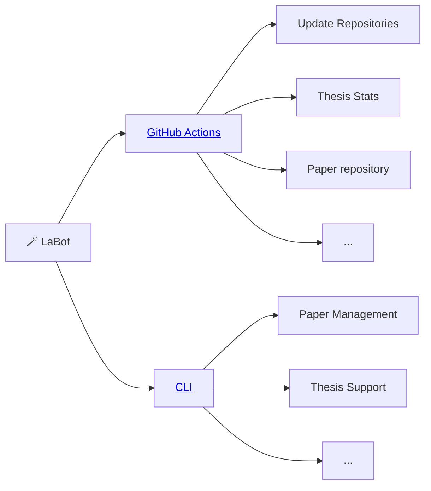

# 🪄 LaBot: Facilitating work in the Digital-Work Lab



## GitHub actions

Labot also runs as a GitHub action in different repositories (in the `labot.yaml`, which requires repo and workflow rights)
The entrypoint is `labot.repository.main()`.

**Paper repository**

- Checks `paper.md`, uses colrev-sync to update references

## CLI

Run these commands in an empty directory:

```
labot paper --init
labot thesis
```

Work-in-progress:

```
labot status
```


For local tests with chatgpt:

export OPENAI_KEY="your_openai_api_key"
