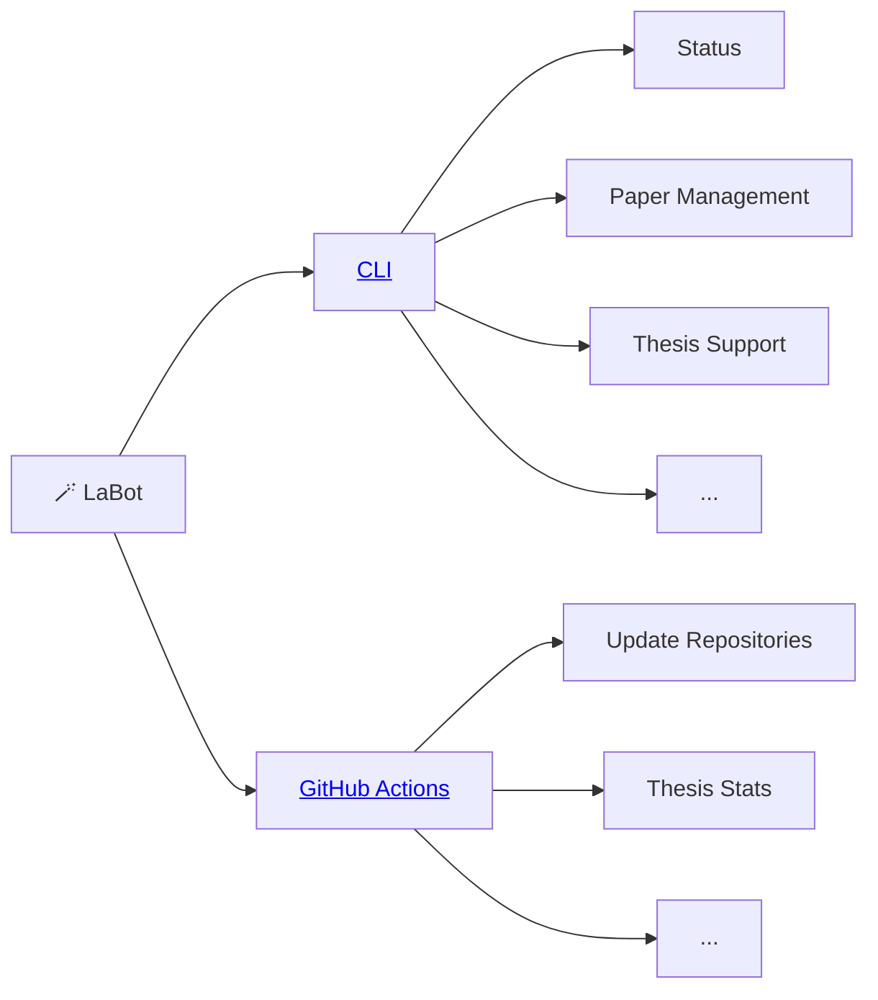

# 🪄 LaBot: Facilitating work in the Digital-Work-Lab



## CLI

Run the following command in the handbook directory:

```
labot status

```

Run these commands in an empty directory:

```
labot paper --init
labot thesis
```

## GitHub actions

Labot also runs as a GitHub action in different repositories (in the `labot.yaml`, which requires repo and workflow rights)
The entrypoint is `labot.repository.main()`.
